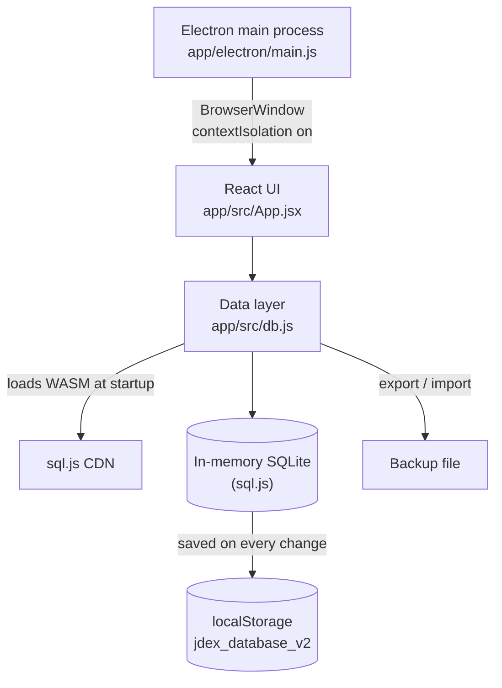

# JDex - Johnny Decimal Index Manager

<div align="center">
  
  
  **Personal Knowledge Organization Made Simple**
  
  [](https://opensource.org/licenses/MIT)
  [](https://github.com/As-The-Geek-Learns/JDEX/releases)
  [](https://github.com/As-The-Geek-Learns/JDEX)
</div>

---

## What is JDex?

JDex is a desktop application that helps you organize your digital life using the [Johnny Decimal System](https://johnnydecimal.com/) - a simple yet powerful framework for structuring files, projects, and knowledge.

### The Johnny Decimal System in 30 Seconds

Instead of deeply nested folders like `Documents/Work/Projects/2024/Q1/ClientA/Reports/Draft/v3.docx`, you organize everything with a simple numbering system:

```
10-19 Administration
  11 Finance
    11.01 Invoices
    11.02 Expenses
  12 HR
    12.01 Policies
    12.02 Benefits

20-29 Projects
  21 Website Redesign
    21.01 Mockups
    21.02 Content
  22 Product Launch
    22.01 Marketing
    22.02 PR Materials
```

Every item has a unique identifier. Need that invoice? It's in `11.01`. Need the website mockups? `21.01`. Simple, memorable, searchable.

---

## Features

- 🗂️ **Visual Index Management** - Browse and manage your Johnny Decimal categories with a clean, modern interface
- 🔍 **Instant Search** - Find any item by number or title in milliseconds
- 📊 **SQLite Backend** - Your index is a SQLite database (sql.js), saved locally and exportable
- 🎨 **Clean UI** - Built with React and Tailwind CSS for a beautiful experience
- 💾 **Local-First** - Your data stays on your machine, no cloud required
- 🔄 **Import/Export** - Backup and share your organizational structure
- 🚀 **Cross-Platform** - Runs on macOS, Windows, and Linux

---

## Installation

### macOS

1. Download the latest `.dmg` file from [Releases](https://github.com/As-The-Geek-Learns/JDEX/releases)
2. Open the DMG and drag JDex to Applications
3. If macOS blocks the first launch (for example, a build that was not notarized), right-click → Open
4. Subsequent launches: Just double-click

### Windows

1. Download `JDex Setup 2.0.1.exe` (installer) or `JDex 2.0.1.exe` (portable) from [Releases](https://github.com/As-The-Geek-Learns/JDEX/releases)
2. Run the installer or portable executable
3. The app is EV code signed by FTL Consulting LLC - no SmartScreen warnings

**Note:** Windows builds are signed with an Extended Validation (EV) certificate for immediate trust.

### Linux (Coming Soon)

Linux builds (AppImage, .deb) are in development. Follow this repo for updates!

---

## Quick Start

1. **Launch JDex** - Open the application
2. **Create Your First Area** - Areas are the top-level (10-19, 20-29, etc.)
3. **Add Categories** - Break down each area into categories
4. **Add Items** - Create specific items within categories
5. **Search & Browse** - Use search or browse your organized index

### Example Structure

```
10-19 Personal Life
  11 Health & Fitness
    11.01 Medical Records
    11.02 Workout Plans
    11.03 Meal Prep Ideas
  12 Finances
    12.01 Budget Spreadsheets
    12.02 Tax Documents
    12.03 Investment Tracking

20-29 Home Projects
  21 Kitchen Renovation
    21.01 Design Inspiration
    21.02 Contractor Quotes
    21.03 Purchase Receipts
```

---

## Building from Source

### Prerequisites

- Node.js 18+ 
- npm or yarn

### Development Setup

```bash
# Clone the repository
git clone https://github.com/As-The-Geek-Learns/JDEX.git
cd JDEX

# The app lives in app/
cd app

# Install dependencies
npm install

# Run in development mode (Vite on :5173 + Electron)
npm run electron:dev
```

### Building Distributables

```bash
# Build for your current platform
npm run electron:build

# Output will be in app/dist-electron/
```

Per-platform builds: `npm run electron:build:mac`, `electron:build:win`, `electron:build:linux`.
For detailed build instructions, see [app/DISTRIBUTION-SETUP.md](app/DISTRIBUTION-SETUP.md).

---

## Technology Stack

- **Frontend:** React 18, Tailwind CSS 3.4
- **Desktop Framework:** Electron 35
- **Database:** SQLite via sql.js (WebAssembly)
- **Build System:** Vite 7, electron-builder 26
- **Icons:** Lucide React

### How data is stored

The whole database lives in the renderer process. At startup `app/src/db.js` loads the sql.js
WebAssembly build from the sql.js CDN (`sql.js.org`), then restores the database from the
browser `localStorage` of the Electron window. Every change is written back to `localStorage`.
Use export (a `.sqlite` backup or a JSON dump) and import (`.sqlite`) to back it up or move it. Because sql.js is fetched from the CDN, the app
needs network access when it starts.

## Architecture



A rendered diagram is in [`docs/diagrams/JDEX.architecture.svg`](docs/diagrams/JDEX.architecture.svg)
(source: `docs/diagrams/JDEX.architecture.json`).

---

## Project Structure

```
JDEX/
├── app/                      # The Electron app (run npm commands here)
│   ├── electron/main.js      # Electron main process (package.json "main")
│   ├── src/
│   │   ├── App.jsx           # React UI (single-file app)
│   │   ├── db.js             # sql.js database: schema, CRUD, search, import/export
│   │   └── utils/            # Validation and error helpers
│   ├── public/               # Static assets (icon)
│   ├── scripts/              # Icon generation, notarization, Windows signing
│   └── dist-electron/        # Build output (generated)
├── scripts/                  # Helpers to create Johnny Decimal folders (macOS / Windows)
└── docs/                     # System documentation and diagrams
```

---

## Roadmap

- [x] Core Johnny Decimal index management
- [x] SQLite database backend
- [x] Search functionality
- [x] macOS distribution
- [x] Windows distribution (EV code signed)
- [ ] Linux distribution
- [ ] File system integration (create/manage actual folders)
- [ ] Cloud sync options
- [ ] Mobile companion app
- [ ] Advanced reporting and analytics
- [ ] Import from existing folder structures

---

## Philosophy

JDex follows the Johnny Decimal philosophy of **"A place for everything, and everything in its place."**

The tool is designed to:
- **Stay out of your way** - Quick to learn, fast to use
- **Respect your data** - Local-first, SQLite-based, easily exportable
- **Be maintainable** - Clean code, well-documented, easy to extend
- **Remain free** - MIT licensed, available to everyone

---

## About the Author

Built by [James Cruce](https://astgl.com), a systems engineer with 25+ years of enterprise IT experience. JDex emerged from a personal need to organize thousands of technical notes, scripts, and project files using a consistent, scalable system.

More projects and technical writing at [As The Geek Learns](https://astgl.com).

---

## Contributing

Contributions welcome! Whether it's:
- 🐛 Bug reports
- 💡 Feature suggestions  
- 📝 Documentation improvements
- 🔧 Code contributions

Please open an issue first to discuss major changes.

---

## License

MIT License - see [LICENSE](LICENSE) for details.

---

## Acknowledgments

- [Johnny.Decimal](https://johnnydecimal.com/) - The organizational system that inspired this tool
- [Electron](https://www.electronjs.org/) - For making cross-platform desktop apps accessible
- The open-source community for the amazing tools that make projects like this possible

---

## Support

- 📧 Email: james@astgl.com
- 🐛 Issues: [GitHub Issues](https://github.com/As-The-Geek-Learns/JDEX/issues)
- 📚 Docs: [Wiki](https://github.com/As-The-Geek-Learns/JDEX/wiki) (coming soon)
- 💬 Discussions: [GitHub Discussions](https://github.com/As-The-Geek-Learns/JDEX/discussions)

---

<div align="center">
  Made with ☕ by James Cruce
  
  [Download](https://github.com/As-The-Geek-Learns/JDEX/releases) • [Documentation](https://github.com/As-The-Geek-Learns/JDEX/wiki) • [Report Bug](https://github.com/As-The-Geek-Learns/JDEX/issues)
</div>
